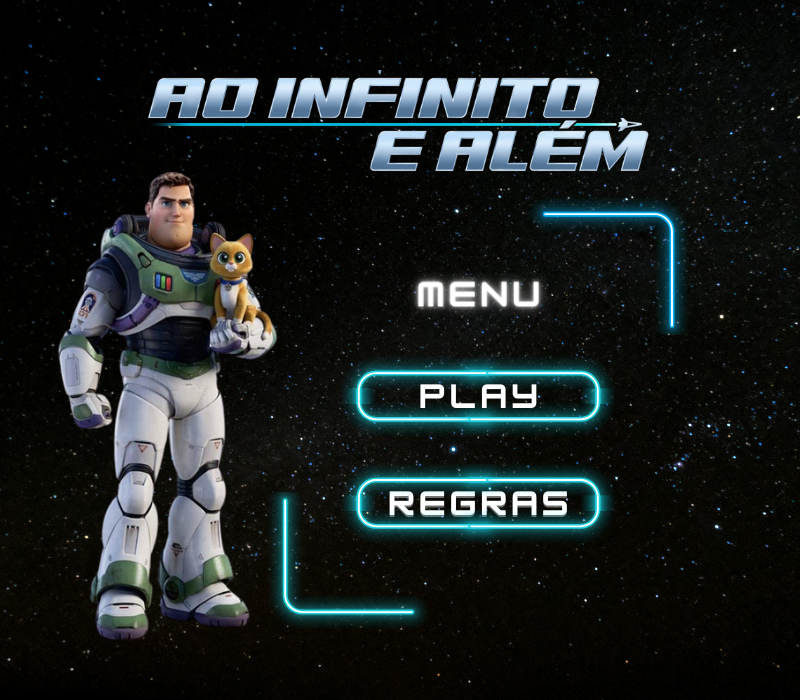

# Jogo "Ao infinito e além"
APS 1 - Algebra Linear e Teoria da Informação - 2021.1

O jogo "Ao infinito e além" foi desenvolvido para a disciplina de Álgebra Linear e Teoria da Informação, ministrada pelo professor Tiago Fernandes Tavares. Sendo uma adaptação do jogo "Angry Birds no espaço", o jogo foi desenvolvido em Python, utilizando a biblioteca Pygame.

<p align="center">
  
</p>

# Video do Jogo
* **Link:** 
* **Descrição:** Video demonstrativo do jogo

# Integrantes do Grupo
* Isabelle da Silva Santos
* Livia Tanaka

# Instruções de Dowload
## Clonando um Repositório
Primeiramente, navegue para o diretório aonde você gostaria de clonar o repositório usando comandos como:
*  cd: para mudar de diretório 
* cd ../ para voltar um nível do diretório <br>

Próximo, clone o repositório remoto e crie uma copia local em sua máquina usando o comando: <br>
**git clone https://github.com/Isabelleatt/ao_infinito_e_alem.git**

Agora, você poderá acessar os arquivos recém baixados com os comandos *cd* e *ls*

## Instalando o necessário
É necessário realizar algumas breves instalações para utilizar o código, isso pode ser realizada de forma simples usando o comando: <br>
**pip install pygame**

## Rodando o jogo
Para rodar o jogo é apenas necessário executar o arquivo main.py, podendo o mesmo ser realizado pela ferramente no topo superior direito do Visual Studio code ou usando o seguinte comando: <br>
**python main.py**

## Regras do Jogo

1. O jogador deve acertar as estrelas com a bolinha;
2. Para passar de fase, o jogador deve acertar todas as estrelas;
3. O jogador possui 3 vidas a cada fase;
4. O jogo possui 4 fases que se tornam cada vez mais difíceis;
5. Os planetas são os obstáculos do jogo, que possuem uma força gravitacional que atraem a bolinha para o seu centro;
6. Para lançar a bolinha, o jogador terá como apoio para mirar em direção as estrelas, uma linha branca que indica a direção e a força do lançamento;
7. O jogador pode utilizar a força gravitacional dos planetas para acertar as estrelas, porém, se a bolinha colidir com um planeta, o jogador perde uma vida;
8. Na 3° e 4° fase, o jogador poderá utilizar um portal para teletransportar a bolinha para o outro local do espaço, facilitando que a bolinha desvie dos planetas;

# Descrição Matemática | Modelo Físico

## Lançamento da bolinha

Para obter o vetor da direção do lançamento, subtrai-se a posição do mouse do usuário do centro da bolinha. 

Já que para realizar o movimento o jogador deve posicionar clicar o mouse em uma posição como se estivesse lançando a bolinha com um "elástico".

```
direcao = np.array(self.pos_centro) - np.array(pos_mouse)
```

Visando, encontrar um vetor de mesmo argumento e mesma direção, porém com módulo igual a 1, do vetor calculado anteriormente, realiza-se o seguinte cálculo.

```
modulo_vetor = np.linalg.norm(direcao)
vetor_aceleracao = direcao/modulo_vetor
```

Quanto maior a distância do mouse em relação a bolinha, maior a velocidade do lançamento. Por isso, a magnitude do vetor de aceleração (```self.vel```) é calculada através da força elástica. 
$$
\boldsymbol{F_e} = K * x
$$
Sendo $K$ a constante elástica, e $x$ o quanto o elástico se deformou, nesse caso a distância (em módulo) entre centro da bolinha e o clique do jogador.

```
mag_a = 1 * abs(direcao)
self.vel = vetor_aceleracao * mag_a
```
## Movimento da bolinha
A movimentação da bolinha é realizada através do movimento uniforme.

```
self.pos = self.pos + 0.1 * self.vel
```

## Força gravitacional dos planetas

```
direcao = self.pos - pos_bola

modulo_vetor = np.linalg.norm(direcao)
vetor_aceleracao = direcao/ modulo_vetor

mag_a = self.c / modulo_vetor ** 2

a_bola = vetor_aceleracao * mag_a
vel_bola = vel_bola + a_bola
```
O cálculo da velocidade da bolinha atraída pelo planeta, é praticamente o mesmo que o do lançamento, porém com a magnitude do vetor velocidade calculada através da força gravitacional.

$$
\boldsymbol{F_g} = C / d^2
$$

Sendo $d$ a distância entre centro do planeta e a posição da bolinha.

$$
\boldsymbol{C} = G * M * m
$$

E $C$ o produto entre a constante gravitacional, a massa do planeta e a massa da bolinha.


